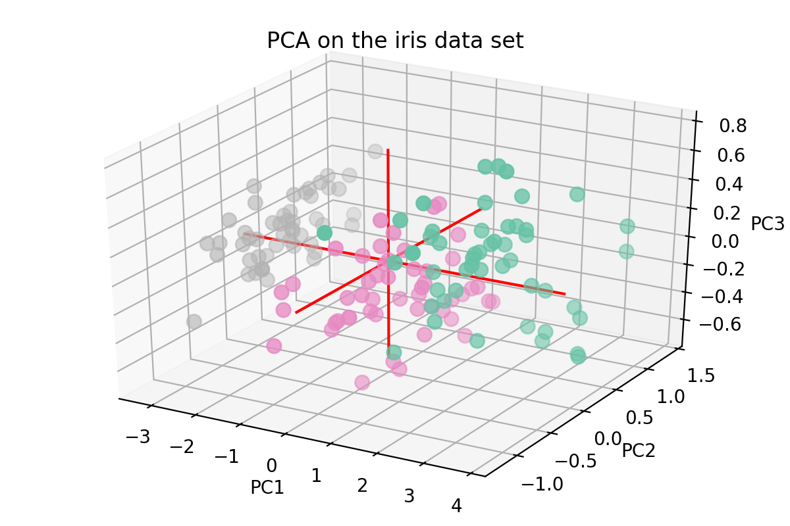
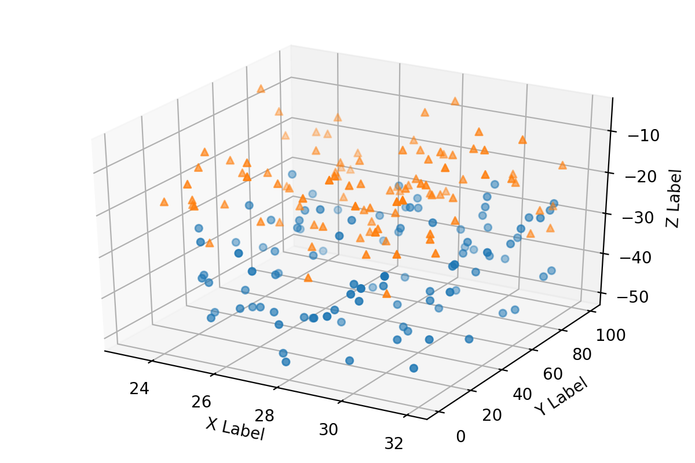
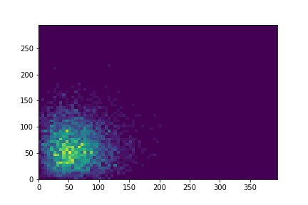
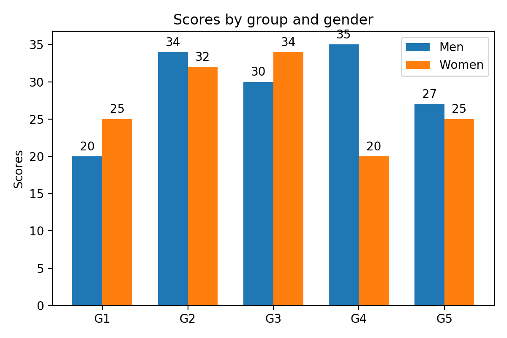
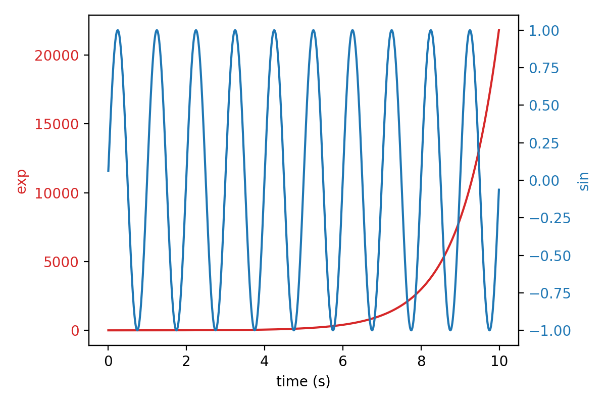
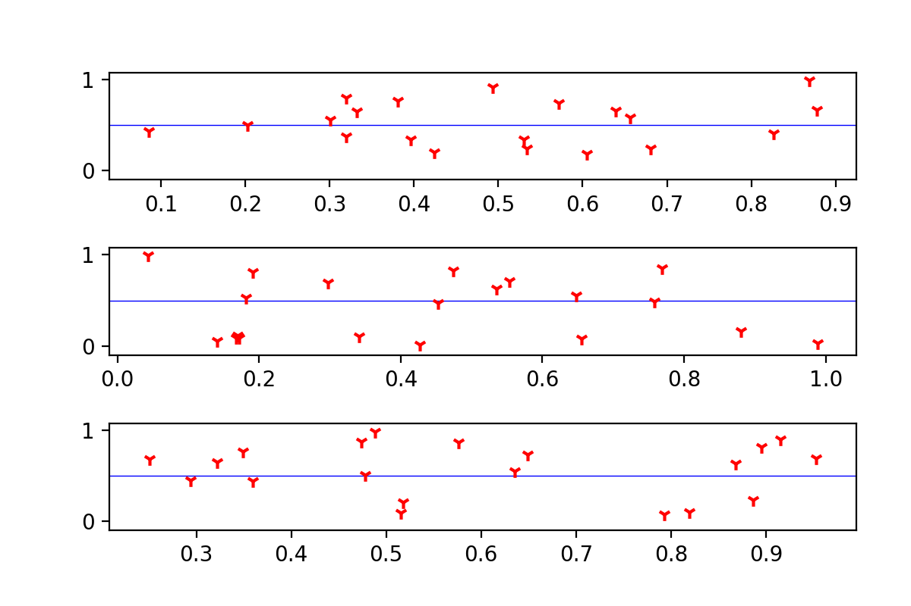

# Python-Gallery
Collections of different kinds of graphs

[1-PCA 3D graph](https://github.com/kikyo91/Python-Gallery/blob/master/1-PCA%203D%20graph.ipynb)

[2-scatter3d](https://github.com/kikyo91/Python-Gallery/blob/master/2-scatter3d.ipynb)

[3-Heatmap to represent (x,y) coordinates in a given rectangular area](https://github.com/kikyo91/Python-Gallery/blob/master/3-Heatmap%20to%20represent%20(x%2Cy)%20coordinates%20in%20a%20given%20rectangular%20area.ipynb)

[4-Grouped bar chart with labels.ipynb](https://github.com/kikyo91/Python-Gallery/blob/master/4-Grouped%20bar%20chart%20with%20labels.ipynb)

[5-Plots with different scales.ipynb](https://github.com/kikyo91/Python-Gallery/blob/master/5-Plots%20with%20different%20scales.ipynb)

[6-horizontal line in subplots.ipynb](https://github.com/kikyo91/Python-Gallery/blob/master/6-horizontal%20line%20in%20subplots.ipynb)

